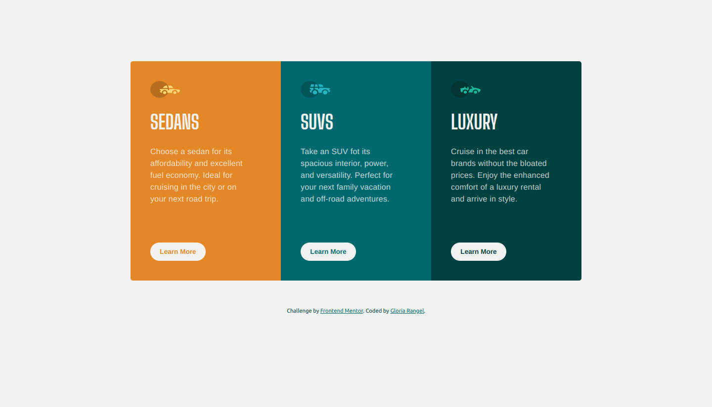
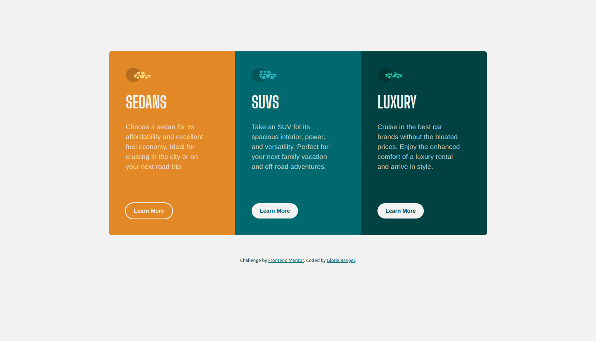
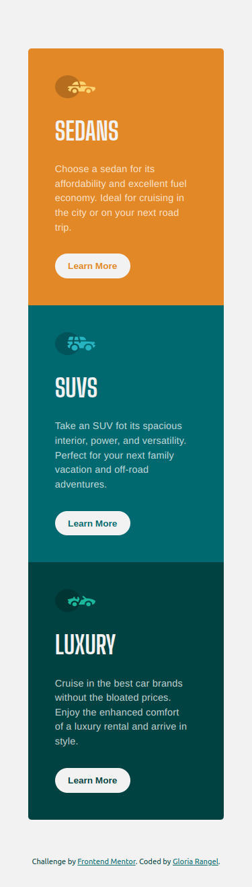

# 🖼 Frontend Mentor - 3-column preview card component solution

This is a solution to the [3-column preview card component challenge on Frontend Mentor](https://www.frontendmentor.io/challenges/3column-preview-card-component-pH92eAR2-). Frontend Mentor challenges help you improve your coding skills by building realistic projects. 

##  📋 Table of contents

-  Overview

-  Screenshot

-  Links

-  My process

-  Built with

-  Useful resources

- What I learned

-  Author

-  Thanks

##  📖 Overview

For this challenge, I used **ReactJS** with **Vite** to build a responsive **3-column preview card component**. The main goal was to create a layout that adjusts seamlessly depending on the screen size, ensuring an optimal user experience across devices.

**The challenge focused on two key aspects:**

-  **Responsive Design:** Building the layout to shift dynamically between different screen sizes, testing my ability to create fluid and adaptable layouts.
-  **Interactive States:** Implementing hover effects for interactive elements, enhancing the user experience and making the interface more intuitive.

I chose to use ReactJS to efficiently manage the component structure and ensure reusability, while Vite helped streamline the development process with fast builds. This challenge provided an excellent opportunity to practice handling responsiveness and user interactions in a real-world scenario.

###  📸 Screenshot

These are the screenshots of the implemented solution:

-  **🖥️ Desktop version**

-  **👆 Hover**  

-  **📱 Mobile version**

###  ⛓️ Links

-  src folder: [src](https://github.com/NorimNori/3-column-preview-card-component/tree/main/src)

-  components folder: [components](https://github.com/NorimNori/3-column-preview-card-component/tree/main/src/components)

-  Live Site URL: [on Netlify](https://3-column-preview-card-component-by-gr.netlify.app/)

##  📌 My process

###  🪚 Built with

-  React.js

-  Vite

-  SCSS styles

-  Flexbox

-  CSS Grid

-  Mobile-first workflow

-  BEM class naming 

-  ARIA (Accesible Rich Internet Applications).

-  Google fonts

###  🔬 What I learned

This project helped me practice working with **ReactJS** and its implementation alongside **Sass (or SCSS)**. I learned how to effectively integrate Sass into a React project to manage styles in a more modular and organized way. It also gave me hands-on experience in structuring components in React, using state and props, and understanding how to apply advanced CSS features like variables, nesting, and mixins in combination with **React's component-based architecture**.

###  📝 Useful resources

-  [Vite Guide](https://vite.dev/guide/) -  This link leads to the official Vite documentation, which provides a comprehensive step-by-step guide on setting up a project with Vite, including how to configure React with Vite. It covers installation, project setup, and the features that make Vite a fast and modern tool for web development.

-  [React with Vite](https://carlosazaustre.es/react-vite) -  This link leads to an article in Spanish that explains how to set up a React project using Vite. It provides a detailed step-by-step guide on initializing and configuring a React app with Vite, making use of its fast build times and modern development features. Although the article is in Spanish, you can easily translate it using Google Chrome's translation feature to read it in your preferred language.

-  [Styling React Using Sass](https://www.w3schools.com/react/react_sass_styling.asp) -  This link leads to a W3Schools article explaining how to style **React** components using Sass. It provides a step-by-step guide on how to integrate **Sass** into your React project and how to utilize its advanced features, such as variables, nesting, and mixins, to write more modular and maintainable CSS in React applications.

##  👋 Author

-  LinkedIn - [Gloria Rangel](https://www.linkedin.com/in/gloria-rangel-06b960306/)

-  Frontend Mentor - [@NorimNori](https://www.frontendmentor.io/profile/NorimNori)

##  🌟 Thank You 🌟

Thanks for visiting this repository! I hope you found it useful and inspiring, or it was just a fun time.

A special thanks to [Frontend Mentor](https://www.frontendmentor.io) for the challenge and for being such an amazing platform to learn and grow as a developer.

Have a nice day! 😊